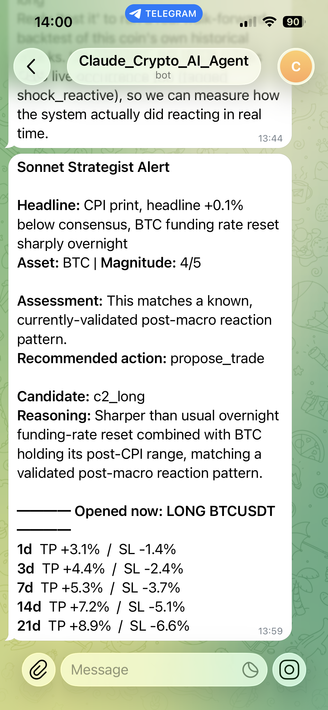
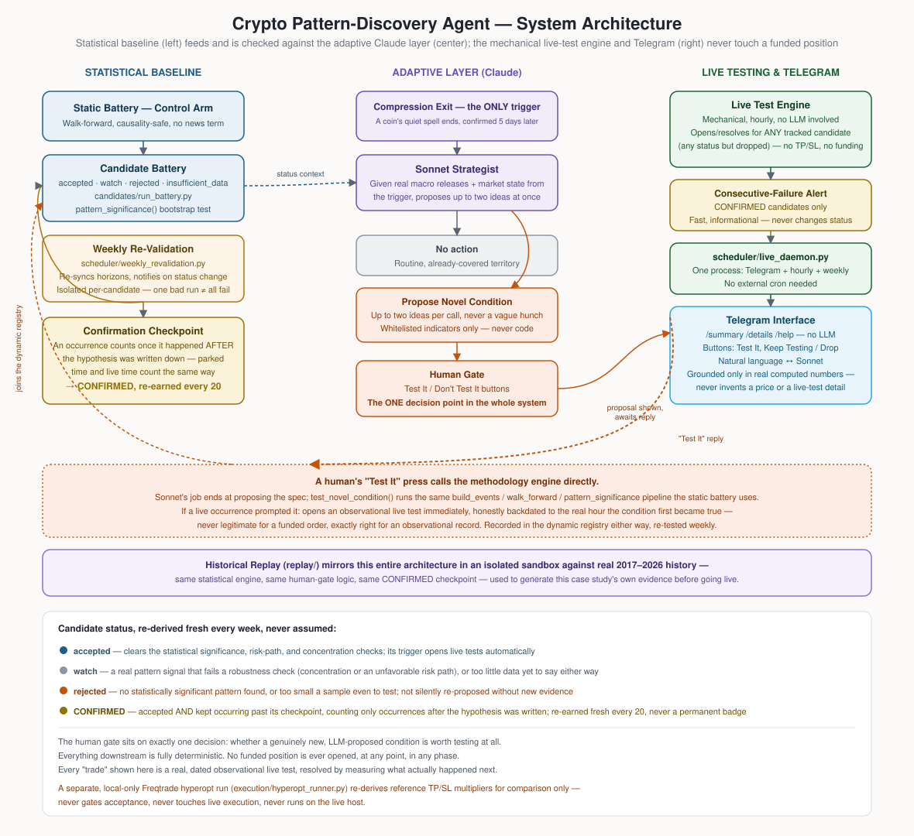

# AI Agent on Freqtrade: Testing Whether Market Sentiment and Financial News Can Create Predictable, Tradeable Patterns in Crypto

    

## What This Project Tests

Whether an LLM-driven architecture — reading real market news and recognizing specific, recurring market conditions as they happen — can be used to predict where crypto prices go next, closely enough to actually trade on it. In plain terms: after a specific kind of announcement (say, a Federal Reserve interest-rate decision), under a specific kind of market condition (say, Bitcoin's price swinging unusually wide that day and closing lower) — is there a clear, repeatable reaction in that coin's price over the following days, one an AI system could actually recognize and act on in real time? Everything below (the historical research, the statistical baseline, the Haiku/Sonnet judgment layer, the human gate on testing genuinely new patterns) exists to answer that one question honestly and live, rather than assume the answer from a backtest.

## Executive Summary

A prior, static rule-based research phase (Phase 1 below) tested six categories of deterministic market triggers — scheduled macro releases, futures-market crowding, trend-efficiency continuation — across seven years of crypto data, under full walk-forward validation, and found no statistically persistent edge. This project's response to that finding is the adaptive system described above: a continuously re-validated statistical baseline, an LLM judgment layer (Claude Haiku → Claude Sonnet), and a human supervisor at exactly one decision point, observed live rather than assumed from a backtest.

## Target Objectives

1. Determine whether adaptive re-validation and LLM-mediated judgment produce a different live result than the static baseline.
2. Do so with a fully causality-safe, leakage-free methodology throughout.
3. Keep every trading decision traceable to a specific signal and a specific piece of data.

The human gate sits on exactly one kind of decision — whether to spend real compute validating a genuinely untested pattern — never on whether a routine, already-validated trade fires: gating every individual trade on a human would test human-plus-LLM judgment, not the LLM's own, defeating the point of objective 1.

<p align="center">
  
</p>

Full build plan: [`docs/case_study/PLAN.md`](docs/case_study/PLAN.md). This project rebuilds an earlier one whose complete prior case study will be linked here once that repository is replaced by this one (see the note at the bottom).

---

## Phase 1: Historical Research & Backtesting Methodology

Before any live component was built, this project ran a systematic historical study of whether deterministic market triggers predict tradeable price moves in crypto — the foundation everything downstream is built on, and honest about what it did and didn't find.

**What was tested.** A battery of trigger categories tied to scheduled financial releases and market-structure signals — FOMC/CPI macro-event reactions, futures/perpetual funding-rate crowding, Kaufman Efficiency-Ratio trend continuation, and volume-delta surges — across BTC, ETH, BNB, XRP, DOGE, ADA, and LTC, using daily and hourly data spanning 2019 through 2026.

**Why the methodology is built the way it is** — five requirements, each chosen for a specific, verifiable reason rather than as boilerplate rigor. Click any one for the reasoning behind it:

<details>
<summary><b>Strict causality lag, enforced structurally, not by convention.</b></summary>

Several trigger definitions are only knowable once the period they describe is fully over — "the day closes bearish" cannot be evaluated before the day closes. Entry is therefore always the *next* period's open following the period a trigger condition reads, with no code path that allows an earlier fill. This matters because the alternative — filling at a price from before that information existed — silently inflates a backtest with information no live system could ever have had.

</details>

<details>
<summary><b>Duration-bucketed, anchor-based exits, never a flat barrier.</b></summary>

Take-profit and stop-loss levels are derived from each horizon's own empirically observed Maximum Favorable/Adverse Excursion (MFE/MAE) at 1, 3, 7, 14, and 21 days, refit walk-forward on each fold's training window only. A flat, arbitrary percentage barrier — the simpler alternative — doesn't reflect how far price actually tends to move before reversing at each horizon, and materially understates or overstates a real trade's risk depending on the coin's own volatility.

</details>

<details>
<summary><b>Purged walk-forward validation with mandatory concentration checks.</b></summary>

Anchors and multipliers are refit on an expanding window using only prior data, and every candidate's out-of-sample result is checked for concentration: is the pooled result actually carried by one coin or one calendar year? A result that doesn't diversify across both is not treated as validated, regardless of its headline number — a single strong year or a single strong coin is not evidence of a general, repeatable pattern.

</details>

<details>
<summary><b>Win rate is always reported with a strict counterpart and a Sortino ratio, never alone.</b></summary>

A headline win rate computed only on decisively-resolved trades can look strong while a large population of inconclusive, loss-leaning timeouts sits outside that denominator. Reporting the strict version (timeouts counted as non-wins) alongside Sortino removes that blind spot.

</details>

<details>
<summary><b>Extreme historical shocks are statistically isolated from the static battery's fitting, not blended in.</b></summary>

A coin's short-term realized volatility is z-scored against its own longer trailing distribution; events where that z-score crosses an extreme threshold are excluded from the anchors and multipliers a fixed rule set is fit and graded against, so a handful of crash days can't distort the barriers applied to ordinary conditions. These excluded events aren't discarded — they're the population Phase 2's live shock-detection pathway is built and validated on instead (see the collapsible section below).

</details>

<h3 align="center">🔍 Technical & Quantitative Methodology Details</h3>

<details>
<summary><b>Fees, Slippage, Variance & Shock Handling</b></summary>

**Trading fees & slippage.** Phase 1's historical backtesting nets every simulated trade against a fixed 0.20% round-trip transaction cost (see Phase 3's battery table) — chosen to validate *directional* edge honestly, not to model exact live execution cost. Slippage is deliberately **not** modeled in this historical study; a static backtest has no order book to simulate against. In live deployment, actual execution friction (taker fees, spread, realized slippage) is not assumed — it's logged directly from Freqtrade's own order-fill records, which reflect what the exchange actually charged, not a backtest assumption.

**Funding / holding costs.** Precision matters here: the historical battery uses a coin's funding rate only as one candidate's *signal* (extreme funding as a crowding indicator, `c1`) — it is not subtracted as an ongoing holding cost from any simulated trade's P&L, long or short. That's a real, stated gap in Phase 1's numbers, not an oversight papered over. In live futures execution (`trading_mode: "futures"`, `margin_mode: "isolated"` — see Phase 2), Freqtrade natively tracks actual funding fee payments on any open position, which do accrue over a real multi-day hold and are visible in the live trade record. **Backtested short-side results should be read as directional validation on spot price data (does the coin tend to fall after this trigger, net of a flat fee), not as a simulation of real futures carry cost** — that distinction only starts to matter once a position is actually held live. One more honestly-stated gap: 3 of the 7 coins (DOGE, ADA, LTC) had no funding-rate history at all until `data_ingestion/market_data/binance_fetcher.py` backfilled it — `c1` currently has only a few months of coverage on those three versus multiple years on the other four, so its result is still mostly carried by BTC/ETH/BNB/XRP; coverage grows every time the fetcher runs.

**Variance non-stationary shift.** Realized volatility in crypto is not stationary — a handful of historic shocks (a 2020-style crash, a 2022-style unwind) can dominate a naive average and produce anchors that fit the crash, not ordinary conditions. This project's fix: a rolling z-score of short-term realized volatility against its own trailing baseline (`candidates/methodology.py::shock_zscore_series`, causally safe by construction — every value uses only bars up to and including itself) flags events crossing an extreme threshold as `shock`-regime; the static battery's anchor-fitting and walk-forward trading use `normal`-regime events only. On the current battery, this excludes between 2 and 78 events per candidate (out of a few hundred), a real, verified effect that moved results moderately without changing any candidate's overall status. Live, `shock`-regime conditions aren't a dead end — they're the input to the shock-detection pathway below.

**Live shock/crash recognition ("Mode B: Live Reactive Entry").** Real-time market data is scanned for the same statistical shock signature Phase 1 uses to exclude extreme events (`llm_pipeline/shock_detector.py`) — when a coin's current short-term volatility crosses that same extreme threshold, Sonnet is escalated directly, independent of any news headline. "Real-time" is literal: every scan (`run_shock_scan()`) refreshes local OHLCV from Binance first (`data_ingestion/market_data/binance_fetcher.py`) rather than reading a static snapshot — the same refresh runs before every weekly re-validation (Phase 3) so the whole battery is graded against current data, not a frozen one-time copy. Sonnet's only available response to a confirmed shock is to propose testing it — using a whitelisted `shock_zscore` indicator, the exact same walk-forward, concentration-checked pipeline as any other novel condition, run specifically on that coin's own historical shock-regime events (the ones excluded from the static battery above). If a human approves and it validates, the resulting anchors trade the live occurrence immediately, tagged `shock_reactive` so its outcome is measured separately from routine battery or manual trades (Phase 4.3) — a direct test of whether the LLM layer can recognize and react to a crash or a bull surge as it's actually happening, not just process routine headlines. An earlier design considered a second "retroactive" mode (simulate an ideal entry at the exact catalyst candle, in hindsight) — dropped deliberately: identifying "the" catalyst candle is itself only possible after the fact, which would have reintroduced the same kind of lookahead bias this project's entire methodology exists to avoid.

</details>

<h3 align="center">The honest finding.</h3>

Applying this methodology across the full candidate battery, static deterministic rule sets did not produce a statistically persistent, cross-coin, cross-year edge. That's the pessimistic baseline this project's live architecture is built to test against — not a result to argue away, and not one this project re-litigates by re-running the same static candidates hoping for a different answer.

<h3 align="center">The Dynamic Agent Thesis.</h3>

Given that a fixed rule set doesn't hold up, this project's central bet is architectural rather than statistical: a system that (1) treats every historical finding as perishable, re-validating the full candidate battery weekly against live data rather than fitting once and trusting it indefinitely; (2) escalates genuinely novel market conditions — by definition, the ones a fixed rule set cannot anticipate — to an LLM judgment layer and a human decision-maker, instead of silently misclassifying them; and (3) writes a structured post-mortem on every closed trade, feeding recognized failure patterns back into what the system already treats as known, rather than repeating the same mistake indefinitely. This doesn't guarantee a different live outcome than the static study found — it's a mechanistically different hypothesis (adaptive judgment plus continuous re-validation, versus one rule set fit once), and this project exists to test it for real rather than assume it inherits the static result.

---

## Phase 2: System Architecture

Two cooperating components, running continuously:

| Module | Role | Status |
|---|---|---|
| **B — Execution Engine (Freqtrade)** | Places and manages trades on the duration-bucketed, anchor-based ladder from Phase 1 — never a flat barrier, and refit on the same weekly schedule as the battery (Phase 3). | ✅ Live (`execution/strategies/sentiment_agent_strategy.py`, `execution/config_live.json`), `trading_mode: "futures"` / `margin_mode: "isolated"` so both long and short can actually execute (spot alone can't hold a short), running on the daily timeframe to match the battery's own validation granularity. Dry-run by default, per the safety guardrails below. |
| **C — Signal Layer** | The candidate battery (Phase 3) plus the Haiku Scout → Sonnet Strategist judgment pipeline. | ✅ Live (`candidates/`, `llm_pipeline/`). |

<h3 align="center">Haiku Scout → Sonnet Strategist</h3>

The adaptive layer at the center of the Dynamic Agent Thesis:

- **Haiku (always-on, cheap):** reads news and market data continuously, extracts asset/sentiment/magnitude/event type, and checks whether current conditions match a known candidate or a logged, already-rejected condition. Routine matches are logged, not escalated — Sonnet's attention is reserved for genuine judgment calls. (`llm_pipeline/haiku_sonnet_pipeline.py`.)
- **Sonnet (escalated, judgment):** given a Haiku escalation, a live read of Freqtrade's actual open-trade state (`llm_pipeline/context_builder.py`, queries the real trade database directly — never a static snapshot) and the live candidate battery status (rebuilt fresh from `live_battery_state.json` on every call, never a hand-maintained file that can drift out of date), proposes one of: no action, watch, propose a trade, propose a novel-condition test, or exit an open position. Every proposal, and the exact data behind it, is logged in full and traceable.
- **A routine trade proposal executes immediately — no human confirmation.** `propose_trade` may only reference a candidate the battery currently lists as `validated` (enforced in code, not just requested in the prompt: `llm_pipeline/haiku_sonnet_pipeline.py::execute_routine_trade` looks the candidate up and refuses to fire if it isn't actually validated, regardless of what Sonnet claims). Since the anchors are already proven, there's nothing left for a human to approve — gating every individual trade on a person would mean testing human-plus-LLM judgment, not the LLM's own, which is exactly the thing this project exists to measure honestly. Telegram is notified after the fact (§4.1), not asked first.
- **Novel-condition escalation is built as a whitelist, not code execution.** A novel-condition proposal can only compose from a fixed registry of indicators (`llm_pipeline/novel_condition_tester.py::SUPPORTED_INDICATORS`) plus a comparison operator and threshold — chosen specifically so there is no path from an LLM proposal to arbitrary executed code. Sonnet's role ends at proposing the spec: a human reply of "test it" calls Phase 1's methodology engine directly (`test_novel_condition`, the exact same walk-forward, concentration-checked pipeline `run_battery.py` uses for the static candidates) — it never routes back through Sonnet, which has no further say in a deterministic test's outcome. The result, validated or not, is written to a persistent registry (`llm_pipeline/dynamic_candidates.py`) that `run_battery.py` re-tests every week alongside the static battery, so a validated condition isn't trusted forever from one approval, and a rejected one is fed back into Sonnet's own context so it isn't silently re-proposed.
- **Real-time shock/crash detection ("Mode B") is a distinct escalation path, market-data-driven rather than news-driven.** `llm_pipeline/shock_detector.py` scans live volatility for the same statistical extreme Phase 1 excludes from the static battery, and escalates directly to Sonnet when found — full detail, including why an "ideal retroactive entry" mode was considered and deliberately dropped, in Phase 1's collapsible technical section.

<p align="center">
  
</p>

---

## Phase 3: Continuous Weekly Re-Validation & Candidate Battery Status

Every candidate signal carries a live status, re-derived — not assumed — on a fixed schedule:

| Status | Meaning |
|---|---|
| `validated` | Clears walk-forward out-of-sample testing and the concentration check. Allowed to place trades unattended. |
| `watch` | Positive signal that hasn't cleared every check yet. Visible to Sonnet as context, never triggers a trade alone. |
| `rejected` | Failed validation. Logged so it isn't silently re-proposed without new evidence. |

### Launch-Day Battery Results

`candidates/run_battery.py`, 7 coins, daily bars, walk-forward OOS, **net of a 0.20% round-trip transaction cost applied to every simulated trade, and with extreme-shock events statistically excluded from fitting** — see the collapsible technical section above for both:

| Candidate | Direction | Status | N | Win Rate | Strict WR | Sortino | Txn Cost (RT) | Timeout % | Shocks Excluded |
|---|---|---|---|---|---|---|---|---|---|
| c1 (funding crowding) | long | rejected | 314 | 36.8% | 30.6% | -4.66 | 0.20% | 16.9% | 24 |
| c1 (funding crowding) | short | rejected | 162 | 83.9% | 64.2% | -3.02 | 0.20% | 23.5% | 20 |
| c2 (post-macro reaction) | long | watch | 62 | 47.3% | 41.9% | +1.19 | 0.20% | 11.3% | 2 |
| c2 (post-macro reaction) | short | watch | 86 | 52.4% | 38.4% | +1.00 | 0.20% | 26.7% | 16 |
| c6 (efficiency trend) | long | watch | 289 | 36.6% | 27.0% | +12.54 | 0.20% | 26.3% | 78 |
| c6 (efficiency trend) | short | rejected | 184 | 58.9% | 41.3% | -2.92 | 0.20% | 29.9% | 30 |

Every candidate above was tested in **both directions** — long and short are not an afterthought, each has its own independently walk-forward-validated result. One precision worth stating plainly: the short-side numbers are a *directional* validation on spot price data (does the coin tend to fall after this trigger, net of the flat fee) — they do not simulate real futures carry cost (funding accrual over the hold), which only starts to apply once a position is actually held live in futures mode (Phase 2). See the collapsible technical section above for why that distinction is real, not glossed over.

The 0.20% fee figure is a fixed, conservative round-trip assumption (entry + exit combined) applied uniformly by `candidates/methodology.py`, not fit per candidate — deliberately, so no candidate can look better than another merely by assuming a friendlier fee. It is not yet coin-specific (a genuinely illiquid pair may realistically cost more in spread/slippage than a top-10 coin); refining it per coin is scoped as a future methodology addition, not assumed away.

**Zero candidates reached `validated` status at launch** — the expected, honestly-reported continuation of Phase 1's finding, not a bug in the battery. In practice this means two things on day one: nothing in `execution/live_battery_state.json` is eligible to fire on its own, and Sonnet's routine `propose_trade` path (§4.1) has no validated candidate to reference either, so it has nothing to act on unattended yet. The only route to a live trade at launch is the human-gated one — Haiku/Sonnet flag a genuinely novel condition, a human approves testing it, and if it validates, that trade fires immediately and any future occurrence joins the weekly-refreshed battery. This is expected, not a shortfall: it's the system correctly refusing to invent a signal it hasn't earned. Two more candidates (stablecoin-supply flow, funding-basis unwind) are scoped in the [build plan](docs/case_study/PLAN.md) for a future data-source addition.

### The Re-Validation Loop That Keeps This Table Alive

Every Sunday, `scheduler/weekly_revalidation.py` first refreshes local OHLCV/funding data from Binance (`data_ingestion/market_data/binance_fetcher.py`), then re-runs the full battery's walk-forward fold and concentration check against that current data, diffs every candidate's status against the previous run, and notifies the human only when something actually changed. Separately, any time Haiku/Sonnet flag a genuinely novel condition, the human can approve an ad-hoc test of it on the spot via the same pipeline, run on demand instead of waiting for Sunday — if it validates, it joins the battery under this same weekly regime. As of this writing, `weekly_revalidation.py` runs on demand; it is not yet wired to an actual scheduled job (Phase 6 of the [build plan](docs/case_study/PLAN.md)).

---

## Phase 4: Interactive Telegram Interface

Two structurally separate interaction modes, kept apart deliberately: **free-text conversation never generates a financial number itself** — every figure a message cites (a price, a win rate, a P&L) is pulled from a real computation or database query, never invented by the language model.

The conversations below are illustrative mockups of the exact message format the live bot produces (verified against the real Telegram screenshot at the top of this page) — the specific figures shown (a `validated` candidate, a closed trade's P&L) are examples, not a claim about the current battery's actual state, which is reported plainly in Phase 3.

### 4.1 Natural-language conversation — market checks and trade triggers

```
You:     How is the market going today?

🤖 Agent: BTC +1.8% (24h), ETH +2.1%, broad risk-on tone. No macro
          releases scheduled today. 2 candidates on watch status,
          nothing validated has fired. Portfolio flat, no open risk.

You:     Do we have any open trades?

🤖 Agent: No open positions right now. Last closed trade: ETH long,
          +4.2%, closed 2 days ago on the 3-day TP bucket.
```

```
🤖 Agent: Signal received — CPI print, headline +0.1% below consensus.
          Flagged as: known macro-day candidate (c2_long),
          currently status = watch. Checking trigger conditions
          against today's range... breakout condition not met.
          No further action required.
```

```
🤖 Agent: It looks like the market should rise, based on a sharper
          than usual overnight funding-rate reset combined with BTC
          holding its post-CPI range — matches candidate c1_long
          (status: validated, last refreshed 3 days ago).

          Opening a LONG position on BTC/USDT.
          Target profit: +2.1% at 1 day, +4.3% at 3 days, +7.8% at
          7 days, +11.2% at 15 days, +15.6% at 31 days.
          Mirroring stop-loss: -1.9% / -3.6% / -6.1% / -8.4% / -9.9%.

          I'll document this in the history report.
```

```
🤖 Agent: Opposite setup on ETH — overnight move looks like an
          overreaction to a since-clarified headline, matches
          candidate c6_short (status: validated).

          Opening a SHORT position on ETH/USDT.
          Target profit: +1.8% at 1 day, +3.9% at 3 days, +6.5% at
          7 days, +9.7% at 15 days, +13.1% at 31 days.
          Mirroring stop-loss: -1.7% / -3.2% / -5.4% / -7.6% / -8.9%.

          I'll document this in the history report.
```

### 4.2 Intra-trade updates and automated post-mortems

```
🤖 Agent: SL hit on the ETH/USDT short (3-day bucket, -3.2%).

          Likely cause: a follow-up headline (regulatory clarity,
          higher magnitude than the original trigger) reversed the
          setup's thesis within 36 hours — faster than the candidate's
          historical median reversal window. This looks like a real
          case of the setup's assumption breaking, not noise; flagging
          this signal for extra scrutiny in this week's re-validation
          run.

          I'll document this in the history report.
```

```
🤖 Agent: TP hit on the BTC/USDT long (7-day bucket, +7.8%).

          Played out close to the candidate's historical median MFE
          for this horizon — no anomaly to flag. Documented.
```

### 4.3 Structured commands and inline keyboards — KPI reporting

This path never touches the language model for the numbers themselves — a command or a button press runs a direct query against the trade database and renders a template. This is deliberate: numeric reporting should never be at risk of being generated rather than computed.

Every closed trade is tagged with its own `signal_class` — `battery` (an unattended, validated candidate fired on its own), `sonnet_confirmed` (Sonnet's own routine proposal, referencing a validated candidate, fired automatically, no human step), `manual` (a genuinely novel condition a human approved testing, then validated), or `shock_reactive` (Mode B's real-time shock/crash response, same human-approved-test path) — so results can be broken out by *how* a trade was decided, not just by coin: a direct measure of whether the LLM's own judgment (`sonnet_confirmed`) holds up against the purely statistical path (`battery`), and whether its judgment on genuinely novel or critical conditions (`manual`/`shock_reactive`) differs from either.

```
You:     /results

🤖 Agent: What breakdown would you like?
          [ By Coin ]  [ By Signal ]  [ By Decision Type ]  [ Overall ]

You:     [taps "By Coin"]

🤖 Agent: Results by coin (all-time):

          Coin   | N  | Win Rate | Net Profit | Max DD | Sharpe | Sortino
          -------|----|----------|-----------|--------|--------|--------
          BTC    | 14 |  57.1%   |  +8.2%    | -4.1%  |  0.91  |  1.34
          ETH    | 11 |  54.5%   |  +5.7%    | -5.8%  |  0.68  |  0.95
          DOGE   |  6 |  33.3%   |  -3.1%    | -9.2%  | -0.22  | -0.31
          BNB    |  9 |  55.6%   |  +3.9%    | -3.4%  |  0.71  |  1.02
          XRP    |  7 |  42.9%   |  +1.1%    | -6.0%  |  0.14  |  0.19
```

```
You:     Show me results for signal c1_long.

🤖 Agent: c1_long (status: validated, refreshed 2026-09-14):

          N=22  Win Rate 59.1%  Strict WR 54.5%  Net Profit +11.4%
          Max DD -4.7%  Sharpe 0.88  Sortino 1.21  Timeout rate 9.1%
```

---

## Repository Structure & Build Plan

```
crypto-sentiment-trading-agent/
├── candidates/                  # Phase 1's methodology + battery: methodology.py, definitions.py, run_battery.py
├── execution/                   # Module B: Freqtrade strategy, config_live.json (futures/isolated), signal_store.py
│   └── strategies/              # sentiment_agent_strategy.py -- the live IStrategy implementation
├── llm_pipeline/                # Haiku Scout, Sonnet Strategist, live context builder, novel-condition tester, shock_detector.py
├── telegram/                    # Both interaction modes from Phase 4, KPI query layer
├── scheduler/                   # weekly_revalidation.py
├── data_ingestion/              # market_data/binance_fetcher.py (keeps data/ current), news_sentiment/ (CryptoCompare)
├── data/                        # Historical + continuously-refreshed market/macro data
├── docs/case_study/             # PLAN.md, this project's build log, and the live-results writeup
└── tests/                       # candidates/methodology.py, status_history.py, novel_condition_tester.py
```

**Safety & guardrails:** every module defaults to dry-run; no trade is ever placed on an LLM-generated number — TP/SL always come from a walk-forward-validated anchor set, structurally enforced (§2). The human gate sits on exactly one decision — whether to spend compute validating a genuinely untested pattern (§2, §4.3-4.4) — never on whether a routine, already-validated trade fires; requiring a human to also bless every individual trade would test human-plus-LLM judgment, not the LLM's own.

**Observation & reporting:** the system runs untouched except for its own scheduled weekly refresh and any human-approved novel-condition tests, for the agreed observation period. No retroactive re-tuning of results already produced — the weekly refresh updates the *live* battery going forward, it does not rewrite what already happened. At the end of the observation window, and at any checkpoint along the way, the KPI dashboard (§4.3) and the full decision log are the report — including if the honest result is "no better than the static baseline Phase 1 already found."

Full build plan, phase by phase: [`docs/case_study/PLAN.md`](docs/case_study/PLAN.md). File-by-file guide to what every module does: [`PROJECT_MAP.md`](PROJECT_MAP.md).

**Prior work this project builds on:** the full case study of the research that led here lives in the prior repository's `docs/case_study/` (Phases 0-13) and is linked from here once that repository is replaced by this one.
