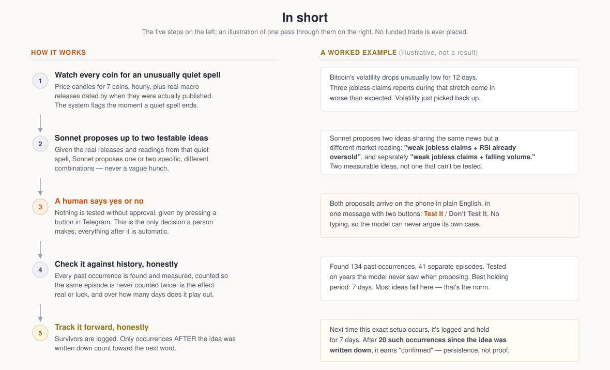
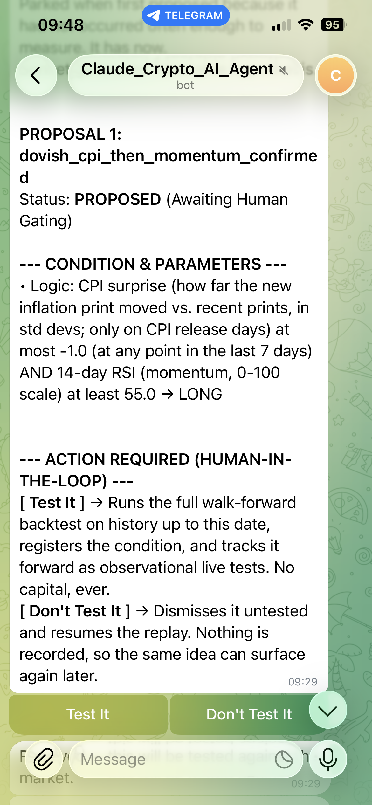
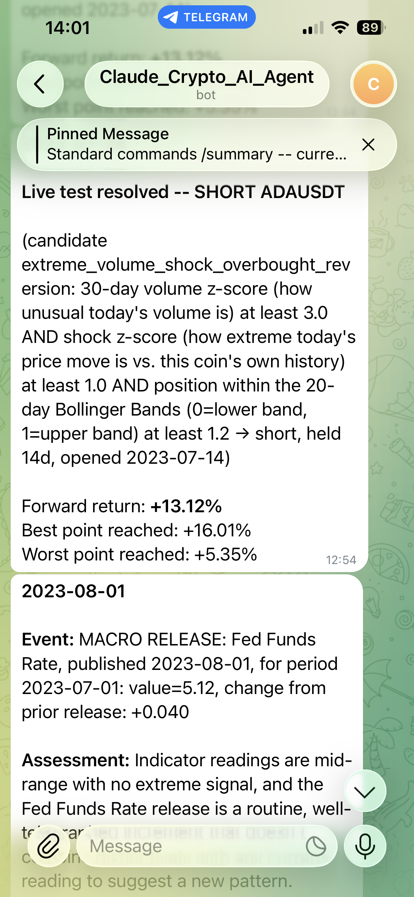
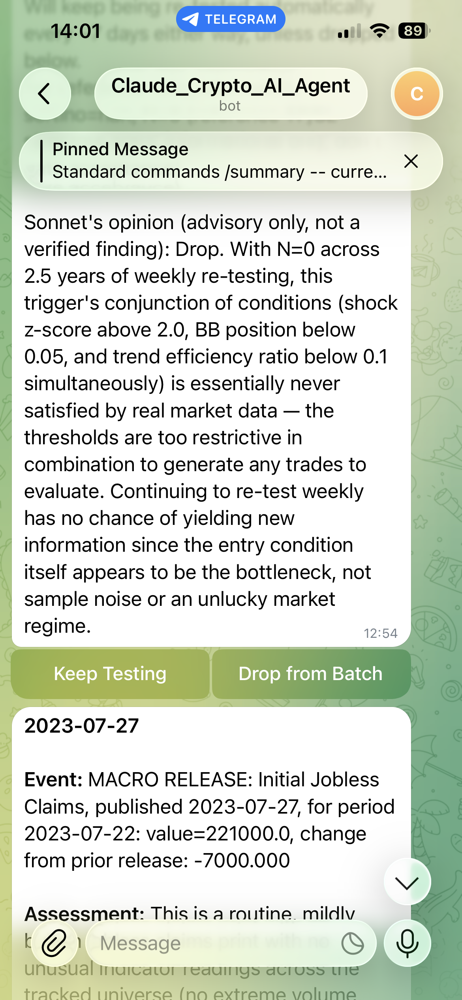
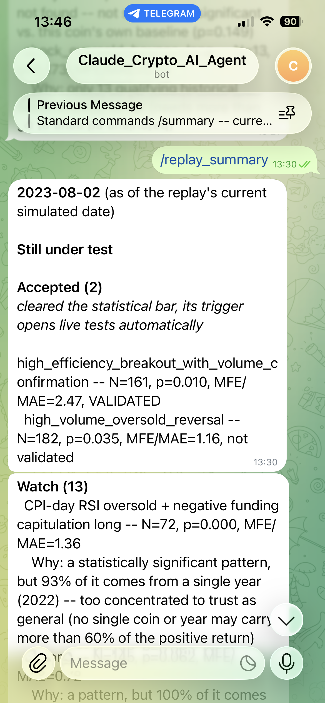
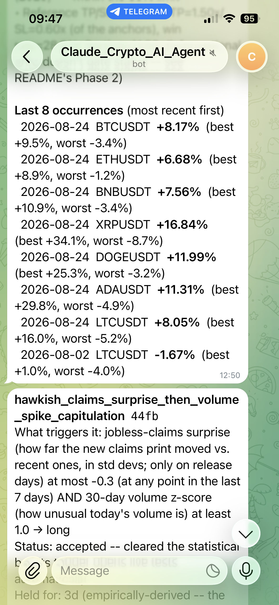
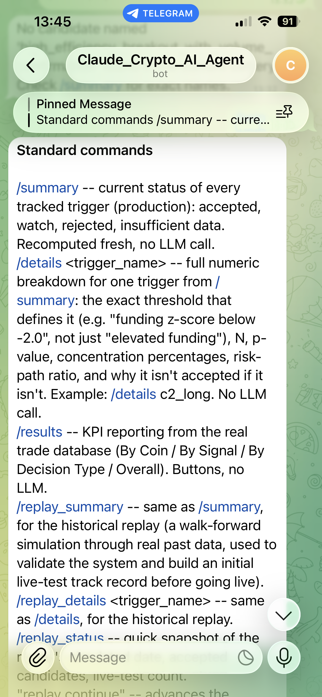

# Crypto Pattern-Discovery Agent: Can Market Sentiment and Real-Time Conditions Reveal Statistically Real, Repeatable Patterns in Crypto Prices?

    

<div align="center">
<table width="82%">
<tr>
<td align="center">
<br>
<b>TL;DR — Key Engineering Highlights</b>
<br><br>
<sub><b>ARCHITECTURE</b><br>
Autonomous Claude Sonnet agent that proposes and tests market hypotheses<br>
(Claude Haiku separately pre-screens news headlines before anything reaches it),<br>
integrated with a Telegram bot interface &amp; human-in-the-loop gating.</sub>
<br><br>
<sub><b>STATISTICAL RIGOR</b><br>
Block-bootstrap significance testing, Benjamini–Hochberg FDR control,<br>
and walk-forward validation with strict causality-lag controls.</sub>
<br><br>
<sub><b>PRODUCTION &amp; DEVOPS</b><br>
Python 3.11+, crash-safe atomic JSON state (fsync + atomic replace),<br>
a synchronous single-process Telegram daemon, and a zero-funded-position<br>
observational engine running via a single daemon scheduler.</sub>
<br><br>
</td>
</tr>
</table>
</div>

## What This Project Tests

Whether an LLM-driven architecture — reading real market news and recognizing specific, recurring market conditions as they happen — can identify genuine, statistically real patterns in crypto prices. Not a paper-trading guess: every candidate pattern is tested directly against that coin's own historical baseline with a real significance test, and once identified, tracked through real, dated occurrences going forward. In plain terms: after a specific kind of announcement (say, a Federal Reserve rate decision), under a specific kind of market condition (say, Bitcoin's price swinging unusually wide that day and closing lower) — is there a clear, repeatable, *statistically significant* reaction in that coin's price over the following days, one an AI system could actually recognize and track as it happens?

**This project never opens a funded position.** It is a knowledge-discovery investigation of patterns, not an investment strategy — every "trade" described below is an observational live test: a real, dated occurrence of a tracked condition, held for a fixed horizon, resolved by measuring what actually happened next. No capital is ever at risk, at any point, in any phase. Everything below (the historical methodology, the statistical significance test, the Sonnet judgment layer, the human gate on testing genuinely new patterns) exists to answer the question above honestly and live, rather than assume the answer from a backtest.

## Executive Summary

An earlier, static rule-based research phase tested six categories of deterministic market triggers — scheduled macro releases, futures-market crowding, trend-efficiency continuation — across seven-plus years of crypto data, under full walk-forward validation, and found no fully persistent, unconditional edge. This project's response is the adaptive system described below: a continuously re-validated statistical baseline, a bootstrap significance test that asks whether a pattern is *real* (not merely profitable-looking in one backtest), a Claude Sonnet judgment layer that discovers and proposes genuinely new conditions, and a human supervisor at exactly one decision point — whether a newly-proposed condition is even worth testing. Everything downstream of that one decision is deterministic and code-driven; no further human input is needed.

**How this project checks its own instruments.** A system that reports "no pattern found" has an obvious failure mode: a detector that never fires looks identical to a detector that is broken. Before trusting any null result, this project plants a synthetic signal it already knows the answer to and confirms the pipeline finds it — and confirms a pure-noise arm stays silent. Only once the instrument is shown to work is a real result reported as a fact about the market rather than a bug.

<p align="center">
  
</p>

### Screenshots

<table>
<tr>
<td width="33%" align="center"><br><sub>Sonnet proposes a novel condition — human approves with a button, never free text</sub></td>
<td width="33%" align="center"><br><sub>A live test resolves — real forward return, best/worst point reached, no TP/SL</sub></td>
<td width="33%" align="center"><br><sub>2+ years untested — the human decides Keep or Drop <i>(now delivered as one periodic digest, computed offline)</i></sub></td>
</tr>
<tr>
<td width="33%" align="center"><br><sub><code>/replay_summary</code> — every tracked candidate, grouped by status, recomputed fresh <i>(verdicts shown are pre-audit)</i></sub></td>
<td width="33%" align="center"><br><sub><code>/replay_details</code> — every number behind one candidate's verdict <i>(pre-audit figures)</i></sub></td>
<td width="33%" align="center"><br><sub>The pinned <code>/help</code> reference — every command, always one scroll away</sub></td>
</tr>
</table>

## How It Works

<p align="center">
  
</p>

The static baseline (a fixed set of rule-based triggers, tested once under full walk-forward validation) found no persistent edge on its own — the finding this project's adaptive layer is built to test against, not one it re-litigates by re-running the same rules hoping for a different answer. Every non-obvious methodology or design decision — why each threshold is what it is, why a fixed horizon instead of a TP/SL ladder, why no funded position is ever opened — is logged with its own stated reasoning in [`docs/case_study/methodology-decisions.md`](docs/case_study/methodology-decisions.md). Step-by-step walk-through of what happens on one simulated day, which triggers consult the LLM and which never do: [`docs/case_study/how-the-replay-runs.md`](docs/case_study/how-the-replay-runs.md). File-by-file guide to the whole codebase: [`PROJECT_MAP.md`](PROJECT_MAP.md). Want to run this yourself, step by step, no prior knowledge of the code assumed? See [`HOW_TO_RUN.md`](HOW_TO_RUN.md).

---

## The Telegram Interface

Two interaction modes, kept structurally apart: **free-text conversation never generates a financial number itself** — every figure a message cites comes from a real computation, never invented by the model. **Structured commands and buttons never touch the language model at all** — a fixed set of valid answers is always presented as buttons, never left to free-text guessing.

The messages below are illustrative — real message formats, example figures, not a claim about the current battery's exact state, which `/summary` always reports fresh.

### A pair of ideas, proposed and approved

Bitcoin's volatility has just come out of an unusually quiet stretch. Sonnet is shown what happened during that quiet spell — the real macro releases, dated and graded as a surprise, not just "something came out" — and proposes up to two different, specific ideas at once, sharing one approval:

```
🤖 Agent: COMPRESSION RESOLVED: BTCUSDT

          Quiet since: 2024-02-01 (12 days, volatility 1.7 sd below
          this coin's own normal)
          Broke out: 2024-02-13 (-3.10% that day)

          Assessment: Two ideas worth testing from this squeeze —
          jobless claims worsened twice during it, and the market
          was already stretched two different ways.

          This needs your input.

          1. "weak_claims_then_oversold"

          (jobless-claims surprise worse than expected, within the
          last 7 days, AND 14-day RSI below 30) → long

          2. "weak_claims_then_volume_dryup"

          (jobless-claims surprise worse than expected, within the
          last 7 days, AND 30-day volume z-score below -1.0) → long

          Test It runs a real walk-forward backtest of each condition
          before they are tracked as live tests (no real money is
          ever placed). Don't Test It dismisses them.

          [ Test It ]  [ Don't Test It ]

You:     [taps "Test It"]

🤖 Agent: Historical backtest -- weak_claims_then_oversold

          (jobless-claims surprise worse than expected, within the
          last 7 days, AND 14-day RSI below 30 → long)

          Pattern signal: excess return +2.10% vs. this coin's own
          baseline over the same period, p=0.031, N=134 occurrences
          across 41 separate episodes.
          Risk profile: MFE/MAE ratio=2.05 (favorable -- the typical
          run in your favor exceeds the typical run against you).

          Verdict: ACCEPTED

          This is a historical screening result, not a live track
          record -- the real test is ongoing: added to the battery
          now, re-tested every week.
```

Two ideas rather than one deeper combination is a deliberate design choice, not generosity: each added condition divides how often it has actually happened by roughly eight, so a single three-part idea is usually untestable where two separate two-part ideas both are — and if only one survives, that's a finding a single combined idea would have hidden. If the two ideas turn out to fire on nearly the same days, the second is dropped automatically before it ever reaches a human, since it would just be one idea counted twice.

### A live test, opened and resolved

Once tracked, a candidate's own trigger opens and resolves a live occurrence with no human or model involved — mechanical, hourly detection, no TP/SL:

```
🤖 Agent: 2024-03-04

          Live test opened -- LONG BTCUSDT

          (candidate weak_claims_then_oversold: jobless-claims surprise
          worse than expected AND RSI below 30)

          Held for 7d, no TP/SL.
```

```
🤖 Agent: 2024-03-11

          Live test resolved -- LONG BTCUSDT

          (candidate weak_claims_then_oversold, held 7d, opened
          2024-03-04)

          Forward return: +3.10%
          Best point reached: +4.20%
          Worst point reached: -1.80%

          Confirmation record -- weak_claims_then_oversold
          Occurrence 23 of 307 (needed for a 5% effect at 80% power
          over 7d)
          Trend materialised: 61% of 23 resolved
          Mean best point +3.40%, mean worst -2.10% -- MFE/MAE 1.62
          TP/SL: pending hyperopt cross-check.
```

That second number in "Occurrence 23 of 307" is deliberate, not an oversight: at this project's horizons, proving an effect with real statistical confidence needs occurrences in the hundreds, and no realistic tracking window reaches that. So the system never claims proof — only that a pattern has kept happening and still holds up on the larger sample. That's why the word here is **confirmed**, not "validated": persistence, honestly labeled as persistence.

**A confirmed candidate's own aggregate is, by design, resistant to a short losing streak — a separate, fast alert covers the gap that creates.** A well-established candidate can absorb 20-30 consecutive worst-case losses before its own significance test would ever flip status — correct behavior against noise, but too slow to flag a genuine regime change on its own. So immediately after any live test resolves, if a confirmed candidate's last 2+ resolved live tests came back negative in a row, it fires a purely informational alert — never a status change, long before the aggregate statistics would say anything.

### Natural-language conversation

```
You:     How is the market going today?

🤖 Agent: BTC +1.8% (24h), ETH +2.1%, broad risk-on tone. No macro
          releases in the last 10 days. Nothing currently accepted;
          5 on watch for concentration or risk-path reasons, 1
          rejected on significance. No live tests open.
```

### Structured commands — no LLM involved

`/summary`, `/details`, and `/help` never touch the language model — a command recomputes the real battery fresh (or, for `/help`, prints a static reference) and renders it directly.

```
You:     /summary

🤖 Agent: Still under test

          Watch (4)
          a real pattern signal, but fails a robustness check
          (concentration or an unfavorable risk profile), or too
          little data for the risk check yet
            weak_claims_then_oversold -- N=134, p=0.031, MFE/MAE=1.62
            c1_long (control) -- N=325, p=0.010, MFE/MAE=0.74
            ...

You:     /details weak_claims_then_oversold

🤖 Agent: weak_claims_then_oversold
          What triggers it: jobless-claims surprise worse than
          expected within the last 7 days, AND 14-day RSI below 30.
          Status: watch -- a real pattern signal, but fails a
          robustness check (direction: long)
          Held for: 7d (empirically-derived, re-checked weekly)

          • Historical occurrences (N): 134, across 41 independent
            episodes
          • Statistical significance: significant (p=0.031), excess
            return vs. this coin's own baseline: +2.10%
          • Risk path (mean favorable / mean adverse excursion): 1.62
            (favorable if > 1.0)
          • Coin concentration: 38% from a single coin -- inside the
            60% limit
          • Year concentration: 64% from a single year -- flagged
            above 60%

          Why not accepted: a statistically significant pattern, but
          too much of it comes from one year to trust as general.
```

`/summary` is deliberately terse — a status line answers "what's the verdict" but not "what does 'elevated concentration' actually mean in numbers." `/details <name>` exists for exactly that: the trigger's own exact numeric definition, plus every number behind its current classification, one candidate at a time.

---

## Repository Structure & Build Plan

```
crypto-sentiment-trading-agent/
├── candidates/                  # Statistical methodology + battery: methodology.py, definitions.py, run_battery.py
├── execution/                   # Live test engine (live_testing.py), local-only hyperopt cross-check (hyperopt_runner.py)
├── llm_pipeline/                # Haiku Scout, Sonnet Strategist, live context builder, novel-condition tester, compression_detector.py
├── telegram/                    # Both interaction modes -- free text and structured commands
├── scheduler/                   # live_daemon.py (the one command that runs everything), weekly_revalidation.py
├── data_ingestion/               # market_data/binance_fetcher.py (keeps data/ current, from-scratch backfill capable)
├── data/                        # Historical + periodically-refreshed market/macro data
├── replay/                      # Historical walk-forward simulation used to validate the system and build an initial live-test track record before going live -- see PROJECT_MAP.md
├── forecast/                    # Offline experiments that test the SYSTEM rather than the market: does the pipeline detect a signal known to be there, which gate is too tight, would better news data help. No API calls -- see PROJECT_MAP.md
├── docs/case_study/             # methodology-decisions.md, this project's build log
├── .github/workflows/           # tests.yml -- the tests below run automatically on every push
└── tests/                       # candidates/methodology.py, status_history.py, novel_condition_tester.py, run_battery.py
```

**Running this live is one command:** `python3 -m scheduler.live_daemon`. This project is built to be operated as an agent, not maintained as infrastructure — one process owns the Telegram bot, the hourly scans, and the weekly re-validation, so there's no separate cron job to configure or forget. It picks up right where it left off after a restart.

**Safety & guardrails:** this project never opens a funded position, at any point, in any phase — the single guarantee everything else is built around, not a configuration flag that could be toggled off. Every "trade" described above is an observational live test: a real, dated occurrence tracked and measured, never capital at risk. The human gate sits on exactly one decision — whether a genuinely new, LLM-proposed condition is worth testing at all; everything downstream is deterministic and code-driven, with no further human input needed.

**Observation & reporting:** the candidate battery re-validates weekly against live data; a live test's outcome, once resolved, is never retroactively re-tuned. `/summary` and the full decision log are the report at any point — including if the honest result is "no better than the static baseline already found."

File-by-file guide to what every module does, including cost-optimization details: [`PROJECT_MAP.md`](PROJECT_MAP.md). Every non-obvious methodology or design decision, with its own reasoning: [`docs/case_study/methodology-decisions.md`](docs/case_study/methodology-decisions.md).

---

## About the Author

**Giovanni Dominoni** — Riga, Latvia
[giovanni.dominoni@gmail.com](mailto:giovanni.dominoni@gmail.com) · [LinkedIn](https://www.linkedin.com/in/giovannidominoni/)
