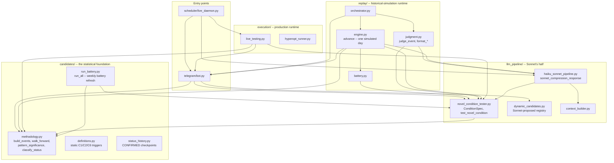
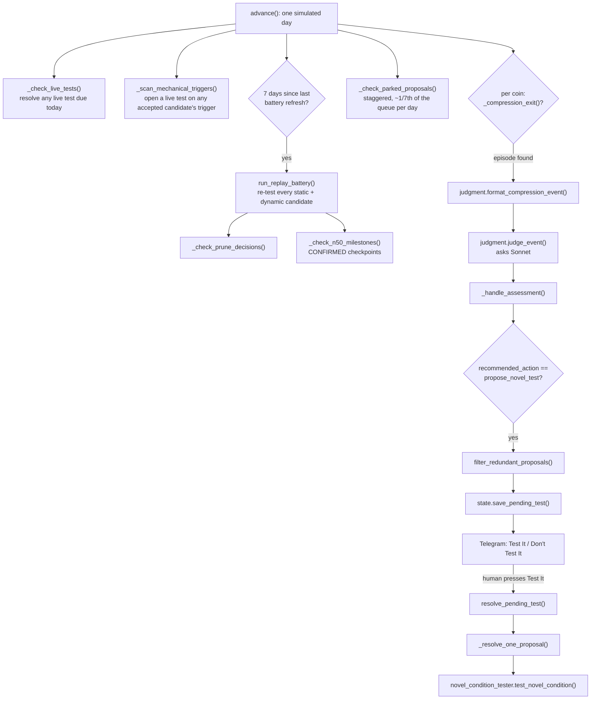
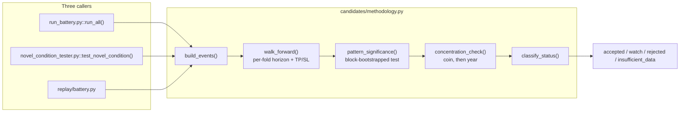
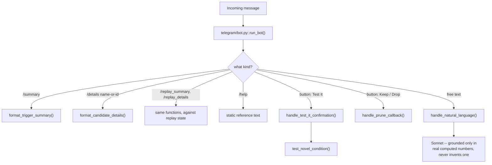

# Methodology Decisions

Reference for **why this project has the shape it has** — not a change log. Every entry: what it is, the real setting used, and why. Companion to [PROJECT_MAP.md](../../PROJECT_MAP.md) (where it lives in code) and [README.md](../../README.md) (what the system does). Numbers here are checked against the current code, not against what was once true.

---

## Code navigation

Four diagrams, each one real call path rather than a full dependency graph — traced from actual imports and function calls, not redrawn from memory. `candidates/` is the statistical foundation everything else is built on; `llm_pipeline/` is Sonnet's half; `execution/` and `replay/` are the two runtimes (real time vs. simulated history) that share both; `telegram/` and `scheduler/` are where a human or a clock enters the system.

### 1. How the packages depend on each other

### 2. One simulated day (`replay/engine.py::advance`)

The same shape production runs continuously, one tick per hour instead of one call per chunk.

### 3. One statistical pipeline, three callers

The acceptance/CONFIRMED machinery lives in exactly one place; the weekly battery, a freshly-proposed hypothesis, and the replay's own battery refresh all run through it rather than each having their own copy.

### 4. Telegram command and callback dispatch

Free text and buttons are handled by entirely separate code paths — see [The Telegram interface](../../README.md) in the README for why.

---

## Vocabulary

### `accepted` vs `CONFIRMED` — two different claims, never interchangeable

`accepted` = the historical backtest cleared every statistical gate (see [Acceptance: `classify_status`'s gate](#classify_statuss-gate-significance-not-pl)). `CONFIRMED` = additionally still `accepted` after a live checkpoint of real, out-of-sample occurrences (see [The CONFIRMED checkpoint](#the-confirmed-checkpoint-milestone_n-20)). A candidate can hold one without the other. "Validated" is never used for either — see [Why "confirmed", not "validated"](#why-confirmed-not-validated).

**Type.** Definitional.

### The CONFIRMED checkpoint: `MILESTONE_N = 20`

Every 20 qualifying occurrences, a candidate is re-tested against the exact bar acceptance itself requires (`min_report_events = 20`) — the checkpoint asks nothing new. A Sonnet-proposed candidate's *first* checkpoint counts backtest occurrences too (`_effective_milestone_count`), so it fires almost immediately on acceptance; every checkpoint after that counts only real live occurrences. A static candidate (C1/C2/C6) always counts live occurrences only. At the median discovery rate (10.8 independent occurrences/year), the second, live-only checkpoint arrives in about 3.7 years.

**Type.** Statistical rigor.

### Why "confirmed", not "validated"

`required_n_for_power` (`candidates/methodology.py`) shows what 20 occurrences can actually prove, at 80% power for a 5% effect:

    horizon    occurrences needed    smallest effect detectable at n=20
     3 days                   121                                12.3%
     7 days                   307                                19.6%
    14 days                   742                                30.4%
    21 days                 1,337                                40.9%

Only a 20-40% move is detectable at n=20 — a result that size would be a bug to chase, not a discovery. So the word is "confirmed": the condition kept occurring and still passes re-test, nothing stronger. A real caveat: because the checkpoint re-fires every 20 occurrences, a candidate with no real effect has roughly a 58% chance of reaching CONFIRMED at least once by chance over 150 occurrences — one reason it's re-earned fresh each time, not kept permanently.

**Type.** Statistical rigor.

### `min_report_events = 20` — the sample-size floor for acceptance

`classify_status` requires more than 20 out-of-sample events before ruling `accepted`/`watch`/`rejected` at all — below it, the verdict is `insufficient_data`. Set low enough that sample size itself isn't the bottleneck ahead of the gate that actually answers "does a pattern exist" (statistical significance); if nothing clears the bar even here, that's a real finding, not something to engineer around. Mirrors [`MILESTONE_N`](#the-confirmed-checkpoint-milestone_n-20) by design.

**Type.** Compromise (yield vs. rigor).

---

## Acceptance: how a hypothesis clears the bar

### `classify_status`'s gate: significance, not P&L

A candidate is `accepted` if `pattern_significance` finds a statistically significant, out-of-sample effect in its own traded direction, with a favorable risk path (mean MFE > mean MAE), not carried by a single coin or period. Win rate, Sortino, and a TP/SL backtest are still computed and shown, but do not gate acceptance — a real, small edge can fail a P&L gate purely because a barrier structure is too wide to register it, and a barrier structure can look profitable by fitting the same noise it's graded against.

**Type.** Direct consequence of the project's stated goal (find a real relationship, not optimize a barrier).

### The significance test: one-sided, block-bootstrapped

`pattern_significance` compares a condition's mean forward return, at its own walk-forward-selected horizon, against the same coin's own returns over the *same calendar stretch* — never the whole multi-year history, which would compare a volatile year to a calm baseline. The test is one-sided (only "works in the direction actually traded" counts), via a moving-block bootstrap rather than a t-test, because financial returns are fat-tailed and overlapping windows are serially correlated — both break a t-test's assumptions. See [The bootstrap itself](#the-significance-bootstrap-_block_bootstrap_means-custom-not-scipystats).

**Type.** Statistical rigor.

### `SIGNIFICANCE_ALPHA = 0.10`, not the textbook 0.05

Measured against a real synthetic null: the moving-block bootstrap is conservative on overlapping windows, so alpha=0.10's real false-positive rate is about 5% — the price 0.05 usually buys elsewhere. Detection of real planted effects roughly triples (8% → 27%) for that same real cost. Benjamini-Hochberg still runs on top of every acceptance — see [Multiplicity control](#multiplicity-control) — so nothing here is unchecked.

**Type.** Statistical rigor, measured rather than assumed.

### Horizon selection: chosen on train, scored on standardized excess

Each walk-forward fold picks its holding horizon (from 1/3/7/14/21 days) using only the training fold, then measures the effect only on the held-out test fold — the same discipline already applied to TP/SL multiplier selection. The score is excess return over the period-matched baseline, divided by the event sample's own standard deviation — not raw mean return, which grows with horizon from pure market drift and would just pick the longest horizon on offer regardless of any real effect.

**Type.** Statistical rigor (fixes a real measured bias — see [Selection-bias defects](#four-defects-found-in-one-statistical-audit)).

### Market-relative vs. raw outcome (`ConditionSpec.outcome`)

A hypothesis is graded against either the coin's own raw return (`"raw"`) or its return minus the equal-weight basket (`"market_relative"`). Raw is correct for a market-wide event (a CPI print moves all of crypto, so subtracting the market deletes the effect); market-relative is correct for a coin-specific claim, where it roughly halves the noise (pooled SD 16.2% → 11.4%) by removing the ~0.54 average cross-coin return correlation. Declared per hypothesis, never inferred after the fact.

**Type.** Statistical rigor (a real, measured power gain, but only in the case it applies to).

### Coin-scoped hypotheses (`ConditionSpec.coins`)

A spec can declare itself about specific coins, which both restricts which coins its trigger fires on and waives the coin-concentration check for that spec — a coin-concentration gate is meaningless for a claim that was never about generality. The year-concentration check still applies unchanged. See [Concentration checks](#concentration-checks-no-single-coin-or-year-above-60).

**Type.** Statistical rigor.

### Concentration checks: no single coin or year above 60%

`concentration_check` (`MAX_GROUP_SHARE = 0.6`) flags a candidate whose positive out-of-sample return is more than 60% attributable to one coin or one year — the failure mode that let a single-coin or single-year fluke pass as a general pattern in an earlier version of this project. Runs on the same raw per-event forward returns `pattern_significance` itself uses, never on a TP/SL-conditioned number, so the two can't disagree about what "the return" means.

**Type.** Statistical rigor.

### Four defects found in one statistical audit

A deep audit of `candidates/methodology.py` found the significance test was badly miscalibrated, compounding into every prior "accepted" result being false:

1. **Direction wasn't checked.** Horizon selection used `abs()` and the p-value's tail was chosen after seeing the data — a candidate could be `accepted` while its measured effect ran opposite to its own traded direction.
2. **The bootstrap resampled independently from overlapping windows**, understating the null's variance. Measured false-positive rate under a true null: **43.3%** against a nominal 5%. Fixed by the moving-block bootstrap above.
3. **Concentration was measured on a different return than acceptance was** (TP/SL-conditioned vs. raw). Fixed: both now use the same per-event forward returns.
4. **`concentrated: False` when there was nothing to concentrate** — a candidate losing on every coin cleared the concentration gate by having no positive return to concentrate. Fixed: returns `None` ("cannot assess"), treated as `watch`.

After the fix: 0 of 98 candidates remained `accepted` (from 2). The false result was reported, not tuned away.

**Type.** Critical statistical bug fix, found by audit and confirmed by execution against real data.

---

## Multiplicity control

### Benjamini-Hochberg, not Bonferroni (`apply_fdr_demotion`)

Every accepted candidate is re-checked as a **family**: `apply_fdr_demotion` demotes any candidate that doesn't survive Benjamini-Hochberg at `FDR_ALPHA = 0.05` back to `rejected` — it can only remove acceptances, never add one. BH rather than Bonferroni because Bonferroni's per-test threshold at a family of ~100 conditions would be ~0.0005, with no power left for the modest real effects this project looks for. The custom implementation was checked against `scipy.stats.false_discovery_control` on the canonical Benjamini & Hochberg 1995 worked example (15 hypotheses → exactly 4 discoveries).

**Type.** Statistical rigor, required once the search space includes many candidates tested at once.

### The family is the testable set, not every row with a p-value

A p-value on a sample of one occurrence isn't a test, so `apply_fdr_demotion` only counts rows `classify_status` could actually classify. Including untestable rows shrinks BH's per-rank threshold for every candidate that could actually be accepted — measured on a 672-condition sweep, more than half the "family" was unusable, making the real threshold roughly twice as strict as intended.

**Type.** Statistical rigor.

### Prior-weighted FDR (`ConditionSpec.prior_weight`)

Sonnet can assign each proposal a plausibility weight (clamped 0.25–4.0, normalized to mean 1 across the family), and Benjamini-Hochberg allocates its alpha budget in proportion — a real, published technique (Genovese, Roeder & Wasserman 2006), not invented here. Weights are fixed at proposal time and never revised, since a weight raised after seeing a result would void the FDR guarantee. Simulated at this project's own family size and power: even a weak prior lifts true discoveries by ~45% while realized FDR stays at or under alpha.

**Type.** Statistical rigor, measured before being built.

---

## The proposal grammar: what Sonnet may write

### Every proposal needs a real macro/news term

At least one of `cpi_surprise`, `rate_surprise`, `jobless_claims_surprise` (`NEWS_EVENT_INDICATORS`) is mandatory in every proposal, enforced in `spec_from_proposal` — not only requested in the prompt. This is the project's actual scope boundary: a condition that would still make sense with the macro release deleted from it is a chart pattern, not what this system exists to test.

**Type.** Definitional / scope enforcement.

### Sequenced conditions (`Clause.within_days`)

`within_days=K` means a clause was true at any point in the last K days, not only today — the only way to express "crash, THEN news" as distinct from "crash AND news, same day." Measured directly: a same-day conjunction has a median of 14 historical occurrences (below the testability floor); the identical hypothesis phrased as a 7-day sequence has a median of 127. The lookback is a claim about the hypothesis, never a knob turned for sample size.

**Type.** Capability, closes a real expressiveness gap.

### The control group: incremental, not unconditional

A condition's effect is measured against the *same condition with its event clause removed*, same period (`baseline_events`) — not the coin's unconditional return. Comparing "shock AND bad news" to an ordinary day credits the shock's own effect to the news; comparing it to "shock alone" isolates what the news actually added. On one real hypothesis this flipped the answer: +1.09% unconditional vs. −0.23% incremental.

**Type.** Statistical rigor — the single change with the largest effect on what a result actually means.

### `MIN_HISTORICAL_OCCURRENCES = 120` — the testability floor

Below 120 raw historical firings, a proposal isn't tested at all (`insufficient_data`). Chosen because the insufficient-data rate falls to about 10% at this value; at a naively "safe-looking" 35, nine of ten proposals admitted at the floor still produced no usable result, because two separate conversions (firings → events, events → held-out folds) both shrink the count before `min_report_events` ever sees it.

**Type.** Compromise, set to stop sample size being the binding constraint.

### `MIN_HISTORICAL_EPISODES = 40` — the redundancy floor

A `within_days` lookback can inflate one real event into many overlapping firings (measured: 8x the raw count for 1.7x the independent evidence). `episode_count` collapses firings into independent episodes **per coin** (never across coins — see [Temporal vs. cross-coin redundancy](#temporal-vs-cross-coin-redundancy-are-two-different-checks) below), and a proposal needs 40 of those, not just 120 raw firings. Currently rarely the binding constraint — the raw floor already screens out most of what this would catch — kept armed because it costs nothing.

**Type.** Statistical rigor, insurance against a failure mode this grammar mostly avoids by construction.

### Threshold relaxation, never toward significance

A too-rare proposal is loosened in the smallest working step (10%, then 25%, then 50% — `relax_to_testable`) toward each indicator's own neutral point (`RELAXATION_NEUTRAL`: 50 for RSI, 0 for anything measured as a deviation) — never past it. The search sees only the occurrence count; no p-value or return is consulted while choosing how far to loosen, which is what keeps this a sample-size decision rather than p-hacking. The substitution is always disclosed before a human approves it.

**Type.** Statistical rigor by construction (structural separation from the outcome, not a discipline that could slip).

### `MAX_PROPOSABLE_CLAUSES = 2`, two proposals per call

A condition may combine at most 2 clauses, and Sonnet returns at most `MAX_PROPOSALS_PER_CALL = 2` proposals per call. Each added clause divides how often a condition has actually happened by roughly eight, so a single three-part idea is usually untestable where two separate two-part ideas both are — and if only one survives, that's a finding a single combined idea would have hidden.

**Type.** Statistical rigor (a direct consequence of the occurrence-count arithmetic).

### Two indicators banned from the grammar, on one principle

`is_macro_day` and `shock_zscore` cannot appear inside a proposed condition (`NON_PROPOSABLE_INDICATORS`) — a trigger must be neither a candidate cause nor the outcome being explained. `is_macro_day` is contentless (a publication happened, not what it said) and is superseded by the graded surprise terms above; `shock_zscore` is present at every proposal by construction (it's why Sonnet was asked at all), so it discriminates nothing at proposal time while narrowing the tested population later.

**Type.** Definitional / scope enforcement.

### `range_zscore_30d` replaces raw `daily_range_pct` as a condition term

Raw daily range is non-stationary — crypto's volatility roughly halved over this project's window, so a fixed threshold on it selects a calendar period (62% of days in 2021, 16% in 2026), not a market state. The z-scored form (30-day rolling window — see [z-score](#z-score-zscore-candidatesdata_loadingpy)) selects a stable ~2% of days every year. Raw form kept in `SUPPORTED_INDICATORS` for reproducibility of past sweeps, but not proposable.

**Type.** Statistical rigor.

---

## The trigger: a confirmed exit from volatility compression

### Why compression, not a macro release or a shock

The only trigger consulted for a new proposal is a confirmed exit from unusually low volatility (`COMPRESSION_ZSCORE_THRESHOLD = 1.25`) — never a macro release or a volatility shock directly. A trigger must be neither a candidate cause (a macro release is one of the things being tested for) nor the outcome being explained (a shock is a magnitude event, and measured post-shock days trend *less* often than ordinary days — 8.8% vs. 11.8% baseline). Compression says a directional move is brewing without saying which way — exactly the question macro context and market state exist to answer.

**Type.** Statistical rigor (the trigger itself was measured, not assumed).

### The exit is confirmed over `COMPRESSION_CONFIRM_DAYS = 5`

A compression episode is a *state* lasting a median of 4 days (up to 38), so triggering on the state itself would re-ask the same question repeatedly within one episode (measured 6.7x duplication). The trigger fires once, on an exit that holds for 5 days afterward — a definition of when two exits count as one event, not a threshold tuned to a result (3 and 5 days give near-identical numbers).

**Type.** Definitional.

---

## Confirmation and live testing

### Live testing: hold for the horizon, no TP/SL

Once `accepted`, a live occurrence opens a live test held for exactly the horizon `pattern_significance` found significant at, then resolved by measuring realized forward return, MFE, and MAE — the same measure acceptance itself used. No barrier check in between, and no funded position, ever, in production or replay: executing with a *different* structure than what was actually tested would measure a different thing than what was accepted.

**Type.** Conceptual consistency, not a compromise.

### `prospective_split` — the only genuinely out-of-sample number

`pattern_significance`'s own held-out test fold is out-of-sample with respect to *parameters*, not with respect to the *idea* — every one of those rows already existed when the hypothesis was written. `prospective_split(spec, coins, proposed_at)` reports what happened only in occurrences that postdate the hypothesis, against the same coins' unconditional return over the same span — reported, never gated (usually underpowered at these counts), but the only number here that answers "has this actually held up since it was thought of."

**Type.** Statistical rigor.

### An occurrence counts toward CONFIRMED when it postdates the hypothesis

Only occurrences that happened *after* a hypothesis was written down count toward its checkpoint (`confirmation_priors.json`) — an occurrence from 2019 cannot confirm a hypothesis written in 2023. Static candidates (mined directly from this project's own history) get zero prior credit, since none of their occurrences postdates the hypothesis by construction.

**Type.** Statistical rigor.

### The consecutive-failure alert (scoped to CONFIRMED only)

`_check_consecutive_failures` fires after each live test resolves, only for a CONFIRMED candidate, if its last 2+ resolved tests were negative in a row. Purely informational — never changes status. Why it's needed: a large, statistically overwhelming sample is *correctly* resistant to short-term noise, but that same resistance means a genuine regime change could take months to show up in the aggregate. Measured directly: a marginal candidate (N=62) flips out of significance after 3 worst-case losses; a strong one (N=289) needs about 30 — the alert closes that gap without touching the aggregate's own correct behavior.

**Type.** Additive, purely informational.

### Freqtrade hyperopt cross-check: informational only

A separate, independent optimizer (Freqtrade's own Bayesian hyperopt, a different search method on a different third-party engine) re-derives TP/SL multipliers for each tracked candidate, purely as a cross-check against this project's own 25-point grid search. Never gates acceptance, never feeds live execution — an independent second opinion is worth more for demonstrating rigor than another chart from the same code path. Runs once after a replay completes, not inline, since it costs several real minutes per candidate against ~190 discovered.

**Type.** Additive verification, zero influence on any verdict.

### The static battery is a fixed control arm, not a second class of candidate

C1/C2/C6 are three deterministic, rule-based conditions tested once under full walk-forward validation before this project's adaptive, LLM-driven discovery layer was built. They found no persistent edge — the finding the whole rebuild exists to test against, kept running as a constant baseline rather than re-litigated by re-running the same fixed rules hoping for a different answer.

**Type.** Design principle.

---

## The LLM's role and cost

### Framing the model as a researcher, not a strategist

Measured on a real 5.5-year replay run: with Sonnet addressed as *"a market strategist,"* 31% of proposals contained no real macro/news term at all, despite that requirement being stated explicitly later in the prompt — a constraint placed downstream of a role definition competes with it rather than qualifying it. The prompts now open by framing the model as a quantitative researcher whose subject is whether an EVENT changes prices, with the operative test stated plainly: *if the idea would still make sense with the release deleted, it's a chart pattern.*

**Type.** Prompt engineering, backed by a measured before/after.

### Cost per testable hypothesis, not cost per call

A single Sonnet call costs $0.0114 — nearly useless for deciding anything, since most calls buy nothing usable. The real metric is cost per testable hypothesis, measured at **$0.34** (thirty times the headline figure) over one real run: about a third of proposals lack a real event term, and four-fifths of what survives never accumulates enough occurrences to be judged. The lever that matters is proposal *yield*, not price per call, since the call costs the same regardless of what it produces.

**Type.** Cost engineering, measured rather than assumed.

### Prompt caching: only the system block, and only when it clears the floor

Cache breakpoints are placed only on the system prompt (the one block genuinely identical across calls) — putting one on the user message instead would hash a different prefix every call and pay a fresh cache-write penalty forever. Only prompts above the API's minimum cacheable size (1,024 tokens for Sonnet) are marked; a shorter prompt with a breakpoint would silently never cache. `/usage` reports cache reads / (reads + writes) as a live health check — near 0% means the breakpoint drifted onto content that actually changes.

**Type.** Cost engineering.

### Keep-or-drop review: deterministic, not a model opinion

`prune_recommendation()` decides whether to keep testing a long-tracked, never-accepted candidate offline, from `required_n_for_power`: well-powered and nothing found → drop (evidence of absence); underpowered or too few occurrences → keep (undetermined, not a negative result). Replaces an earlier version that asked Sonnet for a qualitative opinion built from the same numbers a human could already read directly — the model was narrating figures, not adding evidence.

**Type.** Methodology decision — uses strictly more of the available evidence than an LLM opinion could.

### Haiku and the news-headline path: removed, because a measurement said they couldn't produce evidence

A Claude Haiku layer used to screen live news headlines before Sonnet ever saw them. No indicator this project can test is derived from headline text — the whitelist is entirely FRED-sourced macro surprises — so a flagged headline could prompt a question but never become part of an answer. Before backfilling news history to fix that, `forecast/sentiment_power.py` modeled sentiment as a continuous score parameterized by `rho` (its correlation with the forward return):

    rho     meaning                  accepted/57
    0.00    pure noise floor              2
    0.04    realistic news sentiment      3
    0.08    optimistic                    5
    0.15    implausibly good             20

At the quality a real feed achieves, results are indistinguishable from pure noise. The component was deleted rather than kept for the badge: **I modelled the minimum feed quality this pipeline could detect, measured that realistic feeds fall below it, and deleted the component rather than keep it for the badge.**

**Type.** Capability removal, backed by a measurement made before the alternative (a costly news backfill) was built.

---

## Statistical and Python functions used

Plain-language index of the actual functions behind the numbers above — for pointing at real code, not for re-deriving the math from scratch.

### RSI (`_rsi`, Wilder-style smoothing via `pandas.Series.ewm`)

14-day RSI is built from `pandas.Series.diff()` for day-over-day gains/losses, then `pandas.Series.ewm(alpha=1/14, adjust=False).mean()` — an exponentially-weighted moving average, not a simple rolling mean. This is the standard "Wilder smoothing" RSI is textbook-defined with; the window (14) is the standard default, not tuned.

### z-score (`zscore`, `candidates/data_loading.py`)

`(series - series.rolling(window).mean()) / series.rolling(window).std()`, using `pandas.Series.rolling()`. Turns a raw, non-stationary quantity (volume, funding rate, price range) into "how unusual is today relative to its own last N days." A 30-day window is used everywhere in this project for consistency across indicators. See [`range_zscore_30d`](#range_zscore_30d-replaces-raw-daily_range_pct-as-a-condition-term).

### Sortino ratio (`sortino_ratio`, custom, not a library function)

Mean return divided by downside semi-deviation (root-mean-square of `numpy.minimum(returns, 0)`), annualized by `sqrt(252)`. Reported as informational risk context only — see [`classify_status`'s gate](#classify_statuss-gate-significance-not-pl). Semi-deviation is computed over the *full* sample rather than just the losing subset, because a losing subset sharing one repeated barrier value can otherwise collapse toward zero and blow the ratio up to a meaningless number.

### The significance bootstrap (`_block_bootstrap_means`, custom — not `scipy.stats`)

Not `scipy.stats.bootstrap` or a t-test: a hand-written moving-block resampler, because financial returns are fat-tailed and overlapping return windows are serially correlated, both of which break a t-test's independence assumption. Draws contiguous blocks (`numpy.random.Generator.choice` / `.integers`) of length ≈3× the holding horizon, 2,000 resamples, never crossing a fold or coin boundary. See [The significance test](#the-significance-test-one-sided-block-bootstrapped).

### Forward returns (`pandas.Series.pct_change`)

`df['close'].pct_change(n)` computes the simple n-bar return used as the raw building block almost everywhere: market-state indicators, the outcome `pattern_significance` measures, MFE/MAE. Simple returns, not log returns — at this project's horizons (1-21 days) the difference from compounding is negligible, and simple percentage moves are what MFE/MAE are naturally defined on.

### Expanding-window walk-forward (`walk_forward`, custom)

Each fold refits only on periods strictly before its own test period (an expanding window, grouped by calendar year via a `period` column) — never a fold that could see data from after the period it's grading. Custom rather than a general-purpose cross-validation splitter because fold boundaries here are defined by calendar year to match how this project already reports results, not by row count.

---

## Multiplicity control has to reach the rows it is meant to correct

**What it is.** `apply_fdr_demotion` builds its family from the battery rows that carry a p-value, so every row `classify_status` could act on must actually carry one. Both loops in `candidates/run_battery.py` — static and dynamic — write `pattern_significant`, `pattern_p_value`, `pattern_oos_sd`, `pattern_excess_return` and `pattern_mfe_mae_ratio` into the row, exactly as `replay/battery.py` does in both of its own.

**Why it needs stating.** The dynamic loop used to compute `pattern` (it needed the horizon) and then not carry those five fields. Benjamini-Hochberg therefore saw a family of 3 — the static candidates — while every LLM-proposed candidate was excluded from it: multiplicity control silently inert for precisely the many-hypotheses family it exists to control. Invisible until production had a populated dynamic registry for the first time, because an empty registry has no rows to leave out. Measured the day it did: **11 accepted before the fix, 2 after**, the second figure matching the replay's own final verdicts candidate for candidate. No individual verdict was ever wrong — `test_novel_condition` runs `pattern_significance` internally and `classify_status` gates on it there — but the family pass, the checkpoint message's significance and power lines, and `prune_recommendation`'s keep/drop advice all read these fields and got nothing.

**Type.** Statistical bug fix. The lesson generalises past this instance: a correction that runs over a family is only as good as the family it can see, and a row that silently fails to join one costs nothing at the time it is written.

---

## The universe baseline is keyed on the date, not on a row position

**What it is.** `_market_return_over` (`replay/engine.py`, mirrored in `execution/live_testing.py`) computes what simply holding all seven coins did over the same window as one live test — the denominator behind the "Market-Adjusted Excess" line. It looks each coin up **by date** (`index.searchsorted`), because the coins list at different times and are not row-aligned: position 2000 is 2023-02-16 on BTC and 2024-12-25 on DOGE.

**Why it is worth its own entry.** It used to index every coin by the trade's own integer position, so the "universe baseline" averaged windows years apart. Recomputed correctly over the completed replay's 183 confirmations of `44fb`, the reported figure moves from **+0.56% to -0.10%** per occurrence (56% → 45% positive) — a sign flip, mean absolute change 5.91% per occurrence, so the error was large noise that happened to land favorably. Nothing gated on it: [`pattern_significance`](#the-significance-test-one-sided-block-bootstrapped) computes its own period-matched baseline and never reads this field, so no verdict, p-value, or status moved — but a reported number did, and it was the one qualifying the raw trend rate.

**Type.** Statistical bug fix, found by auditing production against the replay before going live. Every stored `baseline_return` in the replay's completed trade log (23,451 of them) was recomputed with the corrected function rather than left inconsistent with the code that now writes it.

---

## Redundancy: temporal vs. cross-coin

### Temporal vs. cross-coin redundancy are two different checks

`episode_count` collapses firings that are close together in time **within one coin** — it deliberately does not collapse across coins. Seven coins firing on the same macro surprise are seven distinct price paths with seven distinct forward returns, not one measurement repeated: correlated (mean cross-coin correlation 0.54), but not the same observation. Cross-coin dependence is handled by a separate gate — [concentration](#concentration-checks-no-single-coin-or-year-above-60) — which asks whether the result is carried by one asset, not whether it fired on several.

**Type.** Statistical rigor. Reading same-day, multi-coin firings as redundancy would penalize a condition for the one property — generality across assets — that most distinguishes a real market pattern from one asset's own history.

---

## The real result — 2017-08-26 to 2026-09-05, nine years, day by day

159 conditions proposed, tested and tracked. 23,495 observational live tests opened. Zero funded positions, at any point.

    still `accepted` at the end          2
    ever CONFIRMED at a checkpoint       2  (one still accepted today)
    parked, never testable in time      75

**The one that cleared everything**, `hawkish_claims_surprise_then_volume_spike_capitulation` — a jobless-claims print more than 0.3 SD below recent ones, followed within 7 days by a 30-day volume z-score above 1.0, held long for 3 days:

    p-value                                    0.001   (threshold 0.100)
    historical occurrences                     N = 896
    MFE / MAE                                  1.31    (favorable above 1.0)
    coin concentration                         26%     (BNB, inside the 60% limit)
    year concentration                         44%     (2025, inside the 60% limit)
    confirmations postdating the hypothesis    183     (106 independent episodes)
    Benjamini-Hochberg                         survives, on a family of 101

**Two qualifications that belong beside the result.** Chance alone predicts about 10 significant results in a family this size at the raw threshold; 19 showed up, 8 survived BH, and of those, 2 also cleared direction, concentration and risk path. And CONFIRMED is not a permanent badge: `claims_surprise_then_funding_stretched_reversion` reached a checkpoint while `accepted` and is `rejected` today — the label is persistence, re-earned each time and losable.

**Type.** Result, reported with its qualifications. One condition cleared every gate this system has, which is not the same claim as a demonstrated edge — the difference is the reason for all the machinery documented above.
